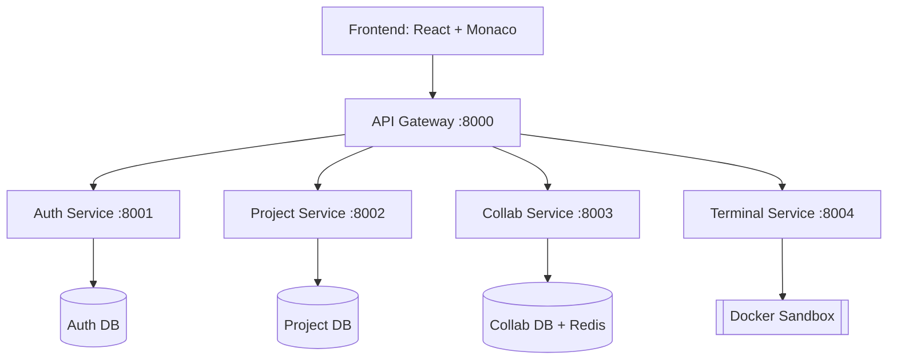

<div align="center">
  <h1>🚀 Helex</h1>
  <p><b>A Collaborative Online Code Editor (VS Code in the Browser)</b></p>
</div>

Helex is a real-time, collaborative online code editor that brings the familiar VS Code interface to the browser. Designed for seamless remote pair programming, it allows team members from different locations to write code simultaneously, complete with real-time sync, colored cursors, and presence indicators.

## ✨ Features

- **Authentication:** Secure Login and Registration using JWT.
- **Project & Team Management:** Organize workspaces with granular roles (Owner, Editor, Viewer) and join via invite links.
- **Advanced Editing:** A robust multi-file editor powered by Monaco Editor (the core of VS Code).
- **Real-Time Collaboration:** Instantaneous code sync and colored cursors using Yjs.
- **In-Browser Terminal:** Execute code safely in a Docker-powered sandbox environment.
- **Built-in Chat:** Project-specific chat for real-time team communication.
- **Future Roadmap:** Voice/video calling and native Git integration.

## 🛠 Tech Stack

| Layer | Technology |
| --- | --- |
| **Frontend** | React, Vite, Tailwind CSS, Monaco Editor, xterm.js |
| **Live Synchronization** | Yjs, y-monaco |
| **Backend** | FastAPI (Python), Microservices Architecture |
| **Database** | PostgreSQL, SQLAlchemy, Alembic |
| **Cache & Pub-Sub** | Redis |
| **Authentication** | JWT, bcrypt |
| **Sandbox Execution** | Docker |
| **Deployment** | Docker Compose, Nginx |

## 🏗 Architecture Overview

Helex is built using a Microservices architecture. Each service operates independently with its own database and communicates via REST APIs or Redis events.



## 📂 Folder Structure

```
helex/
├── backend/
│   ├── api-gateway/         # Handles routing, rate limiting, and auth proxies
│   ├── auth-service/        # Manages users, JWTs, and security
│   ├── project-service/     # Handles workspaces, invites, and roles
│   ├── collab-service/      # WebSocket server for Yjs real-time sync
│   ├── terminal-service/    # Manages Docker sandboxes and web terminals
│   ├── chat-service/        # Handles project communications (Phase 2)
│   ├── shared/              # Shared utilities, schemas, and logging
│   └── infra/               # Docker-compose, Nginx, and DB initialization
├── frontend/                # React application
├── docs/                    # Architecture and API documentation
└── README.md
```

## ⚙️ Prerequisites

Ensure you have the following installed before proceeding:

- **Python:** 3.10+
- **Node.js:** 18 or 20
- **Docker & Docker Compose:** Latest versions
- **Git:** Latest version

## 🚀 Getting Started

### 1. Clone the Repository
```bash
git clone https://github.com/princehk0101/Helex.git
cd Helex
```

### 2. Configure Environment Variables
Copy the example environment files for each service and fill in the required values:
```bash
cp backend/auth-service/.env.example backend/auth-service/.env
cp backend/project-service/.env.example backend/project-service/.env
cp backend/collab-service/.env.example backend/collab-service/.env
cp backend/api-gateway/.env.example backend/api-gateway/.env
cp frontend/.env.example frontend/.env
```
> **Tip:** Generate a random `SECRET_KEY` using Python:
> ```bash
> python -c "import secrets; print(secrets.token_hex(32))"
> ```
> *Note: Ensure the `SECRET_KEY` is identical across all backend services for JWT verification to work seamlessly.*

### 3. Spin up the Infrastructure (Database & Redis)
```bash
cd backend/infra
docker compose up -d postgres redis
```

### 4. Run a Backend Service (e.g., Auth Service)
```bash
cd backend/auth-service

# Create and activate a virtual environment
python -m venv .venv
# On Windows: .venv\Scripts\activate
# On Mac/Linux: source .venv/bin/activate

# Install dependencies and run migrations
pip install -r requirements.txt
alembic upgrade head

# Start the service
uvicorn app.main:app --reload --port 8001
```
*Access the Swagger API documentation at: http://localhost:8001/docs. Repeat these steps for other microservices using their respective ports.*

### 5. Run the Frontend
```bash
cd frontend
npm install
npm run dev
```
*Access the application at: http://localhost:5173*

### 6. Run Everything with Docker Compose
To spin up the entire application stack automatically:
```bash
cd backend/infra
docker compose up --build
```

## 🔐 Environment Variables Guide

**Backend Service Variables:**
| Variable | Description |
| --- | --- |
| `DATABASE_URL` | PostgreSQL connection string |
| `SECRET_KEY` | Key for signing JWTs |
| `ACCESS_TOKEN_EXPIRE_MINUTES` | JWT token expiration time |
| `ALLOWED_ORIGINS` | Permitted frontend URLs for CORS |
| `REDIS_URL` | Redis connection string |

**Frontend Variables:**
| Variable | Description |
| --- | --- |
| `VITE_API_URL` | API Gateway endpoint |
| `VITE_WS_URL` | WebSocket endpoint for real-time collaboration |

> ⚠️ **Warning:** Never commit your `.env` files to Git.

## 🌿 Git Workflow

We use a structured branching strategy to maintain code stability:

| Branch | Purpose |
| --- | --- |
| `main` | Production-ready stable code. Direct pushes are restricted. |
| `develop` | Integration branch for all new features. |
| `feature/<team>-<task>` | For new features (e.g., `feature/backend-auth`). |
| `fix/<team>-<bug>` | For bug fixes. |

**Standard Daily Flow:**
```bash
git checkout develop
git pull
git checkout -b feature/backend-auth
# Make your changes
git add .
git commit -m "feat(backend): implement login API"
git push -u origin feature/backend-auth
```
*After pushing, open a Pull Request (PR) against the `develop` branch. Tag reviewers and wait for at least one approval before merging.*

**Commit Message Convention:**
- `feat:` A new feature
- `fix:` A bug fix
- `docs:` Documentation updates
- `refactor:` Code refactoring without adding features or fixing bugs
- `chore:` Maintenance tasks, setups, or configurations

## 👥 Team Responsibilities

| Role | Scope of Work |
| --- | --- |
| **Backend 1** | API Gateway, Auth Service, Shared Utilities, Infrastructure |
| **Backend 2** | Project Service, Collab Service, Terminal Service |
| **Frontend 1** | Authentication, Dashboard, Workspace UI, File Explorer |
| **Frontend 2** | Monaco & Yjs Integration, Presence, Terminal UI, Chat Interface |

## 🗺 Roadmap

- [ ] **Phase 1:** Monaco + Yjs integration, live sync across 2 tabs (MVP)
- [ ] **Phase 2:** Authentication, JWT, and Database models
- [ ] **Phase 3:** Projects, team members, roles, and invite links
- [ ] **Phase 4:** File explorer and multi-file tab management
- [ ] **Phase 5:** Persistence (saving Yjs state to the Database)
- [ ] **Phase 6:** User presence and colored cursor UI
- [ ] **Phase 7:** Web Terminal and Docker sandboxing
- [ ] **Phase 8:** Project Chat integration
- [ ] **Phase 9:** Production Deployment (Nginx, HTTPS)
- [ ] **Phase 10:** Voice/video calling, Git integration, AI Assistant

## 🛡 Security Notes

- All user passwords are encrypted using `bcrypt`.
- User-executed code strictly runs in isolated Docker sandboxes with enforced Memory, CPU, and Network constraints.
- Authorization and permission checks are strictly enforced on all REST APIs and WebSockets.
- Production deployments require HTTPS and WSS for secure data transit.

## 🤝 Contributing

1. Claim or open an issue.
2. Create a new branch following the Git Workflow.
3. Make small, logical, and clean commits.
4. Open a Pull Request and request a review.
5. Delete your branch after it has been merged.

## 📄 License

This project is licensed under the [MIT License](LICENSE).
